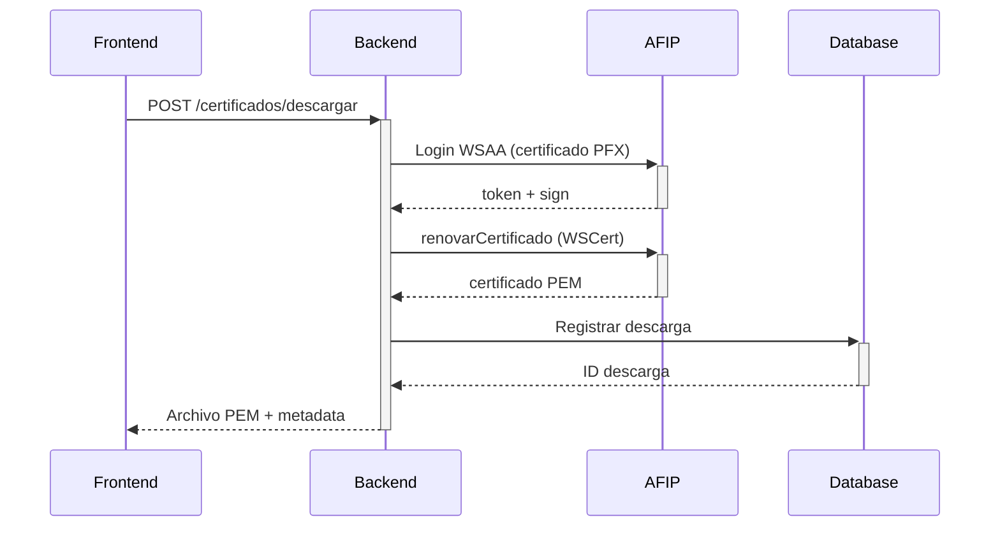

# SERSA - Sistema de Gestión de Certificados CRS

## 📋 Descripción
Sistema web completo para la gestión y descarga de certificados fiscales CRS, desarrollado con arquitectura separada Frontend (Next.js) y Backend (Nest.js) con integración completa a los servicios AFIP.

## 🏗️ Arquitectura Completa
- **Frontend**: Next.js 14 + TypeScript + TailwindCSS + React Query
- **Backend**: Nest.js 10.x + TypeScript 5.x + TypeORM + PostgreSQL
- **Base de Datos**: PostgreSQL con esquema existente
- **Integración AFIP**: Servicios WSAA y WSCert para certificados CRS
- **Autenticación**: JWT con roles y permisos
- **Documentación**: Swagger/OpenAPI automática

## 🚀 Instalación Rápida

### Opción 1: Setup Automático (Windows)
```bash
# Ejecutar el script de instalación completa
setup-completo.bat
```

### Opción 2: Instalación Manual

#### Prerrequisitos
- Node.js >= 18.0.0
- npm >= 9.0.0
- PostgreSQL >= 13 (con base de datos `db_sersa` creada)
- **Certificado AFIP PFX** (solicitar a AFIP)

#### Pasos
```bash
# 1. Instalar dependencias raíz
npm install

# 2. Configurar Frontend
cd frontend
npm install
cp .env.example .env.local

# 3. Configurar Backend  
cd ../backend
npm install
cp .env.example .env
# Editar .env con configuraciones de BD y AFIP

# 4. Colocar certificados AFIP
# Copiar certificado.pfx a backend/certs/
# Verificar Root_RTI.txt y pwrCst.txt

# 5. Ejecutar ambos servicios
cd ..
npm run dev
```

## 📁 Estructura del Proyecto Completa
```
SERSA/
├── 📁 frontend/                    # Next.js Frontend
│   ├── src/
│   │   ├── components/            # Componentes UI
│   │   ├── hooks/                 # Custom hooks (useAuth, etc)
│   │   ├── pages/                 # Páginas Next.js
│   │   │   ├── index.tsx         # Página principal (redirige)
│   │   │   ├── login.tsx         # Login con CUIT
│   │   │   ├── dashboard.tsx     # Panel principal
│   │   │   ├── change-password.tsx # Cambio obligatorio
│   │   │   ├── usuarios.tsx      # Gestión usuarios
│   │   │   ├── certificados.tsx  # Gestión certificados AFIP
│   │   │   └── descargas.tsx     # Historial descargas
│   │   ├── services/             # Servicios API
│   │   ├── styles/               # CSS/TailwindCSS
│   │   └── types/                # Tipos TypeScript
│   ├── package.json
│   ├── tailwind.config.js
│   └── tsconfig.json
├── 📁 backend/                     # Nest.js Backend
│   ├── src/
│   │   ├── afip/                 # Integración AFIP
│   │   │   └── afip.service.ts   # Servicios WSAA y WSCert
│   │   ├── auth/                 # Módulo autenticación
│   │   │   ├── dto/              # DTOs auth (login, change-password)
│   │   │   ├── guards/           # JWT Guard, Roles Guard
│   │   │   └── strategies/       # Passport strategies
│   │   ├── users/                # Gestión usuarios
│   │   │   ├── dto/              # DTOs usuarios (create, update, query)
│   │   │   └── users.service.ts  # CRUD usuarios con validaciones
│   │   ├── certificados/         # Gestión certificados AFIP
│   │   │   ├── dto/              # DTOs descargas
│   │   │   └── certificados.service.ts # Lógica descarga + AFIP
│   │   ├── auditoria/           # Sistema auditoría
│   │   ├── entities/            # Entidades TypeORM
│   │   │   ├── user.entity.ts   # Usuarios con roles
│   │   │   ├── descarga.entity.ts # Descargas con estados
│   │   │   ├── auditoria.entity.ts # Logs auditoría
│   │   │   └── *.entity.ts      # Otras entidades
│   │   ├── config/              # Configuraciones DB, JWT, AFIP
│   │   └── main.ts              # Bootstrap con Swagger
│   ├── certs/                   # Certificados AFIP
│   │   ├── certificado.pfx      # Certificado PFX (NO incluido)
│   │   ├── Root_RTI.txt         # Certificado raíz RTI
│   │   └── pwrCst.txt          # Contraseña del PFX
│   ├── package.json
│   ├── .env.example
│   └── nest-cli.json
├── 📁 docs/                       # Documentación
├── 📁 scripts/                    # Scripts utilidad
├── package.json                   # Workspace root
├── setup-completo.bat            # Instalación automática
└── README.md                     # Esta documentación
```

## 🔐 Sistema de Autenticación Implementado

### Roles y Permisos
1. **Administrador (1)** - Acceso completo
   - Gestionar todos los usuarios
   - Ver todas las descargas y auditoría
   - Cambiar estados de facturación
   - Exportar reportes

2. **Mayorista (2)** - Gestión de distribuidores
   - Crear/editar distribuidores asociados
   - Ver descargas de sus distribuidores
   - Cambiar estados mayorista

3. **Distribuidor (3)** - Descargas
   - Descargar certificados AFIP (con límites)
   - Ver solo sus propias descargas

4. **Facturación (4)** - (Futuro)
   - Gestión específica de facturación

### Flujo de Autenticación
1. **Login** con CUIT (11 dígitos) + contraseña
2. **Cambio obligatorio** de contraseña temporal
3. **JWT tokens** con refresh automático
4. **Control de sesiones** y expiración

### Política de Contraseñas
- Mínimo 10 caracteres
- Al menos: 1 mayúscula, 1 minúscula, 1 número, 1 especial (@$!%*?&)
- Hash con bcrypt (12 rounds)

## 🏭 Integración AFIP Completa

### Servicios Implementados

#### 1. WSAA (Web Service de Autenticación y Autorización)
```typescript
// Login automático con certificado PFX
const credentials = await afipService.loginWsaa('ws_sr_constancia_inscripcion');
// Retorna: { token, sign, expirationTime }
```

#### 2. WSCert (Web Service de Certificados)
```typescript
// Descarga de certificado CRS
const certificado = await afipService.renovarCertificado({
  marca: 'SESHIA',
  modelo: 'ABC123', 
  numeroSerie: '0000001371'
});
// Genera: SESHIA0000001371-2025-08-22.pem
```

### Flujo Completo de Descarga



### Formato de Certificado
```pem
-----BEGIN CMS-----
{Root_RTI_Certificate_Base64}
-----END CMS-----
-----BEGIN CERTIFICATE-----
{Cadena_Certificacion_1_Base64}
-----END CERTIFICATE-----
-----BEGIN CERTIFICATE-----
{Certificado_Principal_Base64}
-----END CERTIFICATE-----
```

## 📊 Funcionalidades Implementadas

### ✅ Gestión de Usuarios
- [x] CRUD completo con validaciones
- [x] Asociación automática mayorista → distribuidor
- [x] Exportación CSV/JSON
- [x] Filtros por rol, estado, mayorista
- [x] Paginación y búsqueda

### ✅ Control de Descargas AFIP
- [x] **Integración completa con WSAA y WSCert**
- [x] **Descarga real desde servicios AFIP**
- [x] **Certificados PFX y autenticación segura**
- [x] Límites personalizables por usuario
- [x] Estados: Pendiente → Facturado → Cobrado
- [x] Validación de límites antes de descarga
- [x] Logs detallados de operaciones AFIP

### ✅ Certificados CRS
- [x] **Servicios AFIP reales (no mock)**
- [x] **Login WSAA automático con certificados**
- [x] **Llamadas WSCert para renovarCertificado**
- [x] Nomenclatura: `MARCA000000SERIE-YYYY-MM-DD.pem`
- [x] Metadata, checksums y auditoría completa
- [x] Descarga directa desde UI

### ✅ Auditoría Completa
- [x] Registro automático de acciones administrativas
- [x] Actor, acción, objetivo, IP, timestamp
- [x] Estados antes/después en JSON
- [x] Consulta con filtros avanzados
- [x] **Registro de operaciones AFIP**

### 🔄 En Desarrollo
- [ ] Sistema de notificaciones (email)
- [ ] Reportes avanzados con gráficos
- [ ] Dashboard en tiempo real
- [ ] Tests automatizados (>80% cobertura)

## 🌐 URLs del Sistema

### Desarrollo
- **Frontend**: http://localhost:3000
- **Backend API**: http://localhost:3001/api
- **Documentación**: http://localhost:3001/api/docs
- **Health Check**: http://localhost:3001/api/health

### Endpoints Principales
```
POST /api/auth/login              # Autenticación
POST /api/auth/change-password    # Cambio contraseña
GET  /api/users                   # Listar usuarios
POST /api/users                   # Crear usuario
GET  /api/certificados            # Certificados disponibles
POST /api/certificados/descargar  # Descargar certificado
GET  /api/descargas               # Historial descargas
PUT  /api/descargas/:id/estado    # Cambiar estado
GET  /api/auditoria              # Consultar auditoría
```

## 🧪 Testing y Calidad

### Scripts de Prueba
```bash
# Frontend
cd frontend
npm run test              # Tests unitarios
npm run test:coverage     # Cobertura
npm run lint             # ESLint
npm run type-check       # TypeScript

# Backend  
cd backend
npm run test             # Tests unitarios
npm run test:e2e         # Tests end-to-end
npm run test:cov         # Cobertura
npm run lint             # ESLint + Prettier
```

### Métricas de Calidad
- **Cobertura objetivo**: ≥80%
- **ESLint**: Sin errores
- **TypeScript**: Strict mode
- **Seguridad**: bcrypt, JWT, validaciones

## 🚀 Despliegue

### Desarrollo
```bash
npm run dev              # Ambos servicios
npm run dev:frontend     # Solo frontend
npm run dev:backend      # Solo backend
```

### Producción
```bash
npm run build           # Compilar ambos
npm run start           # Ejecutar producción
```

### Variables de Entorno Críticas
```env
# Backend (.env)
DB_HOST=localhost
DB_USERNAME=s3rs4
DB_PASSWORD=tu_password
DB_NAME=db_sersa
JWT_SECRET=clave_super_secreta

# Datos AFIP
AFIP_CUIT=20123456789
AFIP_FABRICANTE=MI_FABRICANTE
AFIP_WSAA_URL=https://wsaahomo.afip.gov.ar/ws/services/LoginCms
AFIP_WSCERT_URL=https://wswhomo.afip.gov.ar/wshab/service.asmx?wsdl
AFIP_CERT_PATH=./certs/certificado.pfx
AFIP_KEY_PASSWORD=Panama8523
AFIP_ROOT_PATH=./certs/Root_RTI.txt

# Frontend (.env.local)  
NEXT_PUBLIC_API_URL=http://localhost:3001/api
```

## 📚 Documentación Técnica

### Base de Datos
- **Schema**: Basado en script existente `postgres-sql.sql`
- **Entidades**: Usuario, Descarga, Certificado, Auditoría, Notificación
- **Índices**: Optimizados para consultas frecuentes
- **Constraints**: Validaciones a nivel BD

### Integración AFIP
- **Scripts existentes**: `wsaa.js`, `wscert.js`
- **Adaptación**: Integrados en servicios Nest.js
- **Certificados**: Generación dinámica con metadata

### Seguridad Implementada
- **HTTPS**: Obligatorio en producción
- **CORS**: Configurado para frontend
- **Rate Limiting**: 100 req/min por IP
- **Helmet**: Headers de seguridad
- **Validación**: class-validator en todos los DTOs

## 🔧 Solución de Problemas

### Error de Conexión BD
```bash
# Verificar PostgreSQL activo
pg_isready -h localhost -p 5432

# Probar conexión
psql -h localhost -U s3rs4 -d db_sersa
```

### Error de Dependencias
```bash
# Limpiar e instalar
npm run clean
npm run setup
```

### Error de JWT
```bash
# Verificar JWT_SECRET en backend/.env
# Borrar tokens del navegador (localStorage)
```

## 🤝 Contribución

Ver [CONTRIBUTING.md](./CONTRIBUTING.md) para:
- Flujo de trabajo con Git
- Convenciones de código
- Testing guidelines
- Pull request checklist

## 📄 Licencia

Este proyecto está bajo la licencia MIT. Ver [LICENSE](./LICENSE) para más detalles.

---

**¿Necesitas ayuda?** 
- Revisa la documentación de API: http://localhost:3001/api/docs
- Consulta los logs del servidor
- Verifica las configuraciones de entorno