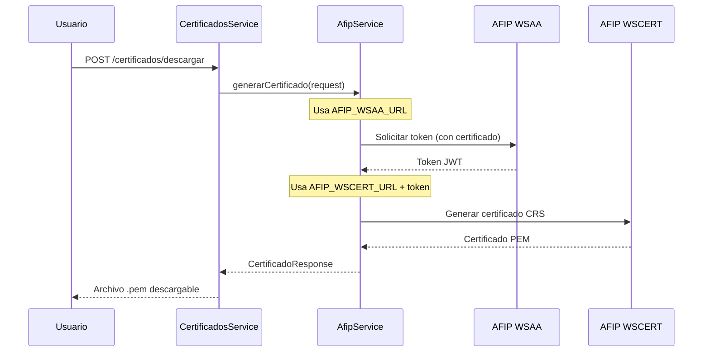

# Configuraciones AFIP - Ruteo y Uso

## 📋 Resumen
Este documento explica cómo las configuraciones del archivo `.env` son ruteadas y utilizadas por los servicios AFIP para la generación de certificados CRS.

## 🔄 Flujo de Configuración

### 1. Definición en `.env`
```env
# URLs de servicios AFIP
AFIP_WSAA_URL=https://wsaahomo.afip.gov.ar/ws/services/LoginCms
AFIP_WSCERT_URL=https://wswhomo.afip.gov.ar/wshab/service.asmx

# Datos del fabricante
AFIP_CUIT=20123456789
AFIP_FABRICANTE=SERSA

# Certificados digitales
AFIP_CERT_PATH=./certs/sersa_certificate.pfx
AFIP_KEY_PASSWORD=password_del_certificado
AFIP_ROOT_PATH=./certs/Root_RTI.pem
```

### 2. Inyección en AfipService
```typescript
// backend/src/afip/afip.service.ts
constructor(private configService: ConfigService) {
  // Ruteo automático desde .env
  this.wsaaUrl = this.configService.get('AFIP_WSAA_URL');
  this.wscertUrl = this.configService.get('AFIP_WSCERT_URL');
  this.cuit = this.configService.get('AFIP_CUIT');
  this.fabricante = this.configService.get('AFIP_FABRICANTE');
  this.certPath = this.configService.get('AFIP_CERT_PATH');
  this.keyPassword = this.configService.get('AFIP_KEY_PASSWORD');
}
```

### 3. Uso en Métodos Específicos

#### WSAA (Web Service de Autenticación y Autorización)
```typescript
private async obtenerTokenWSAA(): Promise<string> {
  // AFIP_WSAA_URL se usa aquí
  const client = await soap.createClientAsync(this.wsaaUrl + '?WSDL');
  
  // AFIP_CERT_PATH y AFIP_KEY_PASSWORD se usan para firmar
  const cms = await this.firmarTRA(tra);
  // ...
}
```

#### WSCERT (Web Service de Certificados)
```typescript
private async generarCertificadoWSCERT(token: string, request: CertificadoRequest) {
  // AFIP_WSCERT_URL se usa aquí
  const client = await soap.createClientAsync(this.wscertUrl + '?WSDL');
  
  // AFIP_CUIT y AFIP_FABRICANTE se usan como parámetros
  const params = {
    cuitFabricante: this.cuit,        // ← AFIP_CUIT
    nombreFabricante: this.fabricante, // ← AFIP_FABRICANTE
    // ...
  };
}
```

#### Firma Digital
```typescript
private async firmarTRA(tra: string): Promise<Buffer> {
  // AFIP_CERT_PATH - Ruta del archivo .pfx
  const certPath = path.resolve(this.certPath);
  const certBuffer = fs.readFileSync(certPath);
  
  // AFIP_KEY_PASSWORD - Password del certificado
  const p12 = forge.pkcs12.pkcs12FromAsn1(p12Asn1, this.keyPassword);
  // ...
}
```

## 🏗️ Arquitectura de Configuración

```
┌─────────────────┐    ┌──────────────────┐    ┌─────────────────┐
│   .env file     │───▶│  ConfigService   │───▶│  AfipService    │
│                 │    │  (NestJS)        │    │                 │
│ AFIP_WSAA_URL   │    │ • Validación     │    │ • obtenerToken  │
│ AFIP_CUIT       │    │ • Tipado         │    │ • generarCert   │
│ AFIP_CERT_PATH  │    │ • Defaults       │    │ • firmarTRA     │
└─────────────────┘    └──────────────────┘    └─────────────────┘
```

## 📁 Estructura de Archivos Requeridos

### Directorio `certs/`
```
backend/certs/
├── sersa_certificate.pfx    # Certificado AFIP con clave privada
├── Root_RTI.pem            # Certificado raíz AFIP (opcional)
└── README.md               # Instrucciones para obtener certificados
```

### Certificado .pfx
- **Qué es**: Archivo que contiene certificado digital + clave privada
- **Origen**: Obtenido de AFIP tras solicitud de fabricante
- **Uso**: Firmar digitalmente las peticiones WSAA
- **Seguridad**: Protegido con password (AFIP_KEY_PASSWORD)

## 🔐 Variables de Entorno Críticas

### Obligatorias
| Variable | Descripción | Ejemplo |
|----------|-------------|---------|
| `AFIP_CUIT` | CUIT del fabricante registrado | `20123456789` |
| `AFIP_FABRICANTE` | Nombre del fabricante | `SERSA` |
| `AFIP_CERT_PATH` | Ruta del certificado .pfx | `./certs/sersa.pfx` |
| `AFIP_KEY_PASSWORD` | Password del certificado | `MiPassword123` |

### URLs de Servicio
| Variable | Homologación | Producción |
|----------|--------------|------------|
| `AFIP_WSAA_URL` | `https://wsaahomo.afip.gov.ar/ws/services/LoginCms` | `https://wsaa.afip.gov.ar/ws/services/LoginCms` |
| `AFIP_WSCERT_URL` | `https://wswhomo.afip.gov.ar/wshab/service.asmx` | `https://certificado.afip.gov.ar/ws/services/CertificadoService` |

## 🚀 Flujo de Generación de Certificado



## ⚙️ Configuración por Ambiente

### Desarrollo/Testing
```env
NODE_ENV=development
AFIP_WSAA_URL=https://wsaahomo.afip.gov.ar/ws/services/LoginCms
AFIP_WSCERT_URL=https://wswhomo.afip.gov.ar/wshab/service.asmx
AFIP_AMBIENTE=testing
```

### Producción
```env
NODE_ENV=production
AFIP_WSAA_URL=https://wsaa.afip.gov.ar/ws/services/LoginCms
AFIP_WSCERT_URL=https://certificado.afip.gov.ar/ws/services/CertificadoService
AFIP_AMBIENTE=production
```

## 🔍 Validación de Configuración

El servicio incluye validación automática:

```typescript
validateConfiguration(): { valid: boolean; errors: string[] } {
  const errors: string[] = [];
  
  if (!this.cuit) errors.push('AFIP_CUIT no configurado');
  if (!fs.existsSync(this.certPath)) errors.push('Certificado no encontrado');
  // ...
  
  return { valid: errors.length === 0, errors };
}
```

## 🚨 Troubleshooting

### Error: "Certificado no encontrado"
- Verificar que `AFIP_CERT_PATH` apunte al archivo correcto
- Comprobar permisos de lectura del archivo
- Validar formato .pfx

### Error: "Token WSAA inválido"
- Verificar `AFIP_WSAA_URL` (homologación vs producción)
- Confirmar que `AFIP_KEY_PASSWORD` sea correcto
- Revisar vigencia del certificado .pfx

### Error: "CUIT no autorizado"
- Verificar que `AFIP_CUIT` esté registrado como fabricante
- Confirmar permisos en AFIP para generar certificados CRS
- Validar que el certificado corresponda al CUIT

## 📚 Referencias

- [Documentación AFIP WSAA](https://www.afip.gob.ar/ws/documentacion/default.asp)
- [Certificados CRS](https://www.afip.gob.ar/controladorasfiscales/)
- [Guía de Fabricantes](https://www.afip.gob.ar/fabricantes-software/)

---

**Nota**: Todas las configuraciones son inyectadas automáticamente por el `ConfigService` de NestJS, permitiendo flexibilidad entre ambientes sin cambios de código.