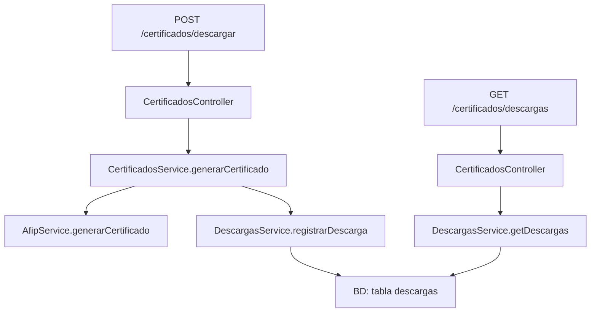

# 🧹 Análisis Completo y Limpieza del Proyecto SERSA

## 📋 Problemas Identificados

### 1. **Duplicación de Archivos**
Los siguientes archivos están duplicados entre módulos:

```
❌ DUPLICADOS A ELIMINAR:
├── src/certificados/entities/descarga.entity.ts (ELIMINAR)
├── src/certificados/descargas.service.ts (ELIMINAR)  
├── src/certificados/dto/descarga.dto.ts (ELIMINAR)
└── src/certificados/certificados.service.real.ts (ELIMINAR)

✅ MANTENER SOLO ESTOS:
├── src/descargas/entities/descarga.entity.ts
├── src/descargas/descargas.service.ts
├── src/descargas/dto/descarga.dto.ts
└── src/certificados/certificados.service.ts
```

### 2. **Confusión de Responsabilidades**
- **CertificadosService** debe enfocarse ÚNICAMENTE en generar certificados via AFIP
- **DescargasService** debe manejar TODO lo relacionado con descargas (BD, estados, consultas)

## 🎯 Estructura Correcta Final

### **Módulo Certificados** (`src/certificados/`)
```typescript
// certificados.service.ts - SOLO generación AFIP
class CertificadosService {
  async generarCertificado() {
    // 1. Validar parámetros (marca="SH", modelo="IA"|"RA")
    // 2. Llamar AfipService.generarCertificado()
    // 3. Delegar a DescargasService.registrarDescarga()
    // 4. Retornar respuesta
  }
}

// certificados.controller.ts - Endpoint principal
@Post('descargar')
async descargarCertificado() {
  return this.certificadosService.generarCertificado();
}
```

### **Módulo Descargas** (`src/descargas/`)
```typescript
// descargas.service.ts - TODO manejo de descargas
class DescargasService {
  async registrarDescarga() { /* Guardar en BD */ }
  async getDescargas() { /* Consultas con filtros */ }
  async updateEstadoDescarga() { /* Cambiar estados */ }
  async getCertificadoPem() { /* Obtener archivo PEM */ }
}

// entities/descarga.entity.ts - Entidad de BD
// dto/descarga.dto.ts - DTOs con validaciones
```

## 🔄 Flujo Correcto



## ⚠️ Validaciones Críticas

### **CreateDescargaDto** debe validar exactamente:
```typescript
export class CreateDescargaDto {
  @IsEnum(['SH']) marca: string;           // SOLO "SH"
  @IsEnum(['IA', 'RA']) modelo: string;     // SOLO "IA" o "RA"  
  @Matches(/^\d{1,10}$/) numeroSerie: string; // 1-10 dígitos
}
```

## 🛠️ Pasos de Limpieza

### 1. **Ejecutar Script de Limpieza**
```bash
# Linux/Mac
bash cleanup-duplicates.sh

# Windows PowerShell
.\cleanup-duplicates.ps1
```

### 2. **Verificar Importaciones**
Asegurar que todas las importaciones apunten a:
- `../descargas/descargas.service`
- `../descargas/entities/descarga.entity`  
- `../descargas/dto/descarga.dto`

### 3. **Verificar Módulos**
- `CertificadosModule` importa `DescargasModule` (no entidades directas)
- `DescargasModule` exporta `DescargasService`

### 4. **Compilar y Probar**
```bash
npm run build
npm run start:dev
```

## 📊 Resultado Esperado

✅ **Sin duplicación de código**  
✅ **Separación clara de responsabilidades**  
✅ **Imports correctos**  
✅ **Un solo flujo de datos**  
✅ **Validaciones precisas**  

## 🚨 Errores Comunes a Evitar

1. **NO** importar entidades de otros módulos directamente
2. **NO** duplicar lógica entre servicios  
3. **NO** mezclar responsabilidades (AFIP ≠ BD)
4. **NO** mantener archivos duplicados

---

**Ejecuta los scripts de limpieza y verifica que la compilación sea exitosa.**